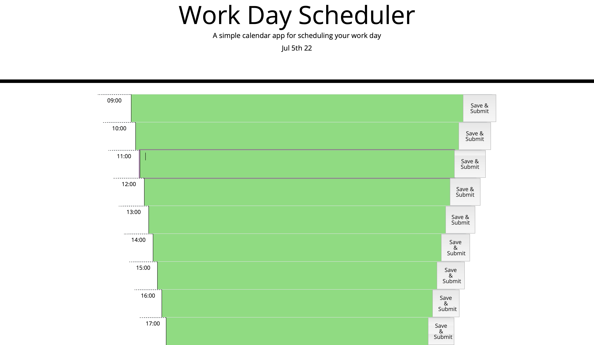
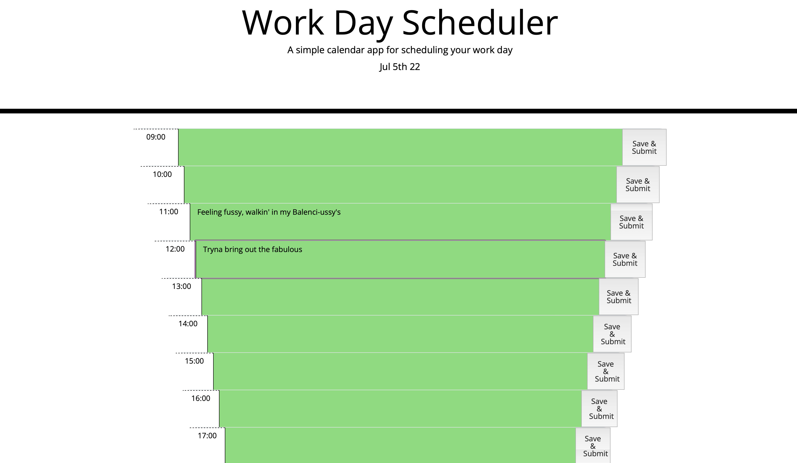
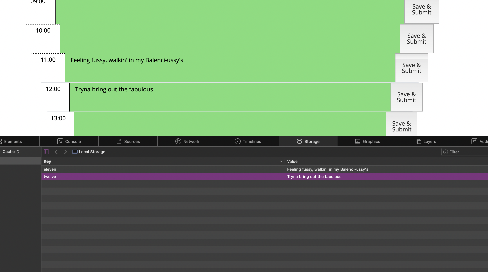

# calend-ely-sched
<h1> Screenshots ~ </h1>

<h1> Description </h1>

This was a project with given starter text for HTML, and CSS files. The JS is completely from scratch. 

The intent of this project was to utilize the series of code in order to make a functioning calendar. This calendar consists of local storage saves, hours (in order from 9 to 5, set in my preferred 24 hour time), and a color-coated system for organization.

<h1> Credits </h1>
This time, my credits go out to Lesli and Noah! This was a wonderful study group, as we worked together through our various problems. It really was a collaborative effort. Thanks to them, I continued to learn. (-: 

<h1> Licensing </h1>
Standard Licensings apply, however, feel free to pull the code -- please, just ask prior to. Thank you (-:

<h1> Deployed Link </h1>